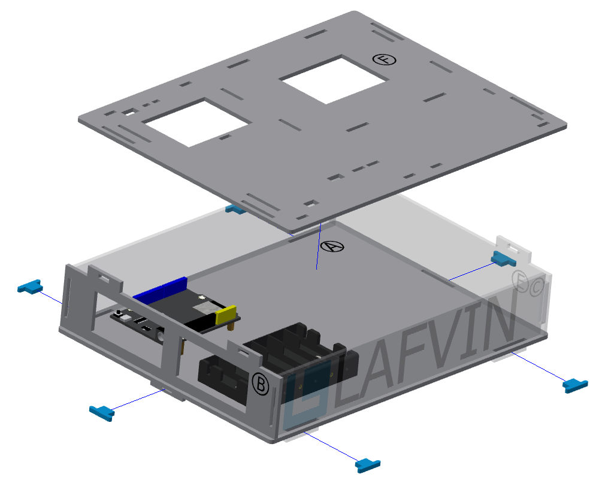
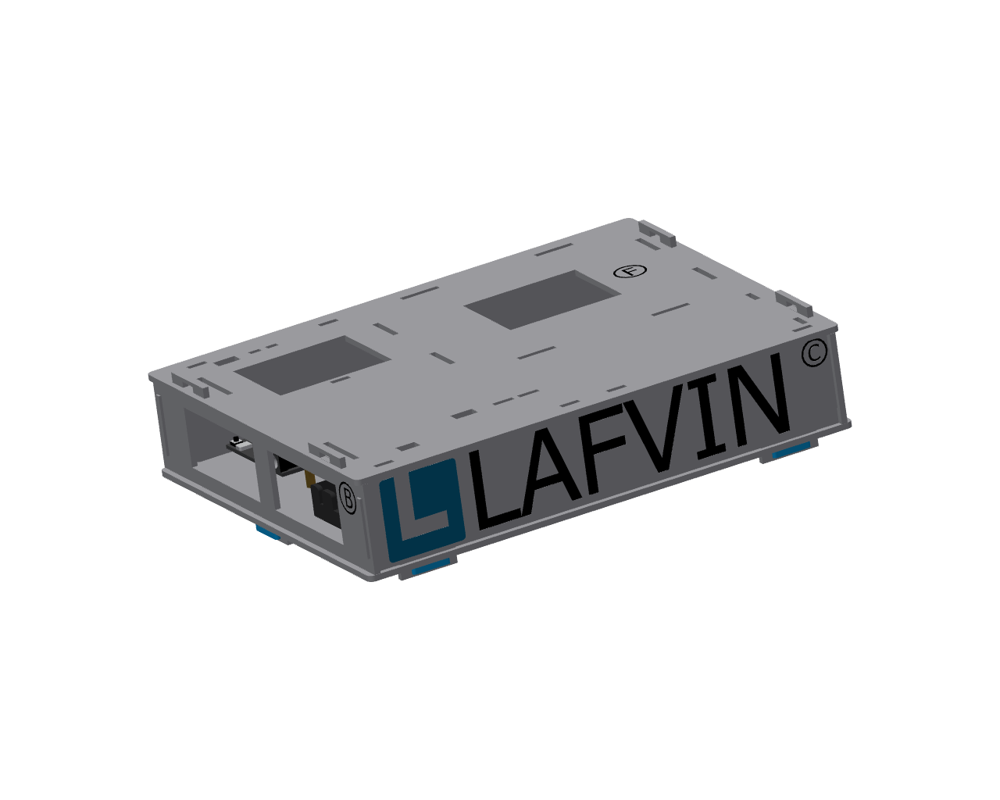

一、底座部分的安装
===========================

步骤 1：ESP32开发板的安装
---------------------------

零件清单：序号为“A”的椴木板、ESP32开发板、M3*8mm螺丝（8颗）、M3*16mm铜柱（4颗）。

安装如下图所示：

.. image:: _static/开发板安装带螺丝.png
   :alt: ESP32开发板安装
   :align: center

.. raw:: html

   

.. admonition:: 注意事项

 - 安装步骤：先将螺丝从序号为“A”的椴木板底面穿入，再放置铜柱并拧紧。随后放置 ESP32 开发板，并将螺丝拧紧固定。
 - 关于序号：椴木板上的序号仅用于区分不同的椴木板。教程示例中序号面朝外以便展示，实际安装时可将序号面朝内。后续椴木板的安装亦应遵循此原则。

步骤 2：电池盒的安装
---------------------------

零件清单：电池盒、M3*10mm平头螺丝（2颗）、M3螺母（2颗）。

安装如下图所示：

.. image:: _static/电池盒带螺丝.png
   :alt: 电池盒安装
   :align: center
 

.. admonition:: 注意事项

 - 固定电池盒时，请使用平头螺丝。若使用圆头螺丝，螺丝会凸出并顶住电池，导致电池无法正常安装。

步骤 3：底座的安装
---------------------------

零件清单：序号为“B、C、D、E、F”的椴木板、蓝色栓扣（6颗）

安装如下图所示：

.. image:: _static/3.底座护板安装.png
   :alt: 底座安装
   :align: center

 

.. admonition:: 注意事项

 - 序号为 “B、C、D、E” 的椴木板安装顺序不受限制，但椴木板 “F” 必须在它们之后安装。
 - 本步骤仅需安装底部的 6 个栓扣，与椴木板 “F” 连接的栓扣暂时无需安装。

底座部分安装完成效果如图所示：

