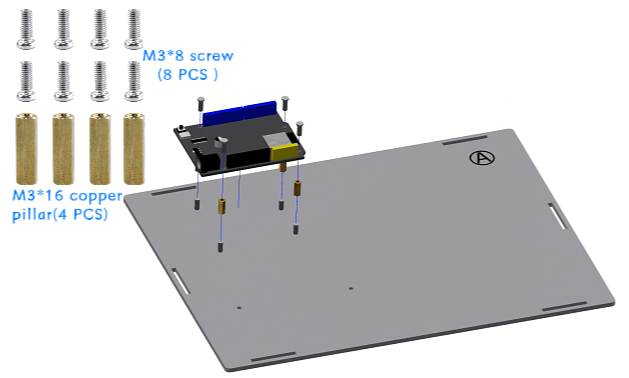

Installation of base part
===========================

Step 1: Install the ESP32 development board
---------------------------

Parts list: Basswood board with serial number "A", ESP32 development board, M3*8mm screws (8 PCS), M3*16mm copper pillars (4 PCS).

The installation is shown in the following figure:

.. raw:: html

   

.. admonition:: Precautions

 - First, insert the screws through the underside of the basswood board numbered "A," then place the copper standoffs and tighten them. Next, place the ESP32 development board and tighten the screws to secure it.
 - The serial numbers on the basswood boards are used only to distinguish one board from another. In the tutorial examples, the serial numbers face outward for ease of illustration, but they should face inward during installation. This principle should also be followed for subsequent basswood installations.

步骤 2：电池盒的安装
---------------------------

零件清单：电池盒、M3*10mm平头螺丝（2颗）、M3螺母（2颗）。

安装如下图所示：

.. image:: _static/电池盒带螺丝.png
   :alt: 电池盒安装
   :align: center
 

.. admonition:: 注意事项

 - 固定电池盒时，请使用平头螺丝。若使用圆头螺丝，螺丝会凸出并顶住电池，导致电池无法正常安装。

步骤 3：底座的安装
---------------------------

零件清单：序号为“B、C、D、E、F”的椴木板、蓝色栓扣（6颗）

安装如下图所示：

.. image:: _static/3.底座护板安装.png
   :alt: 底座安装
   :align: center

.. image:: _static/4.底座盖板-栓扣安装.png
   :alt: 底座安装
   :align: center
 

.. admonition:: 注意事项

 - 序号为 “B、C、D、E” 的椴木板安装顺序不受限制，但椴木板 “F” 必须在它们之后安装。
 - 本步骤仅需安装底部的 6 个栓扣，与椴木板 “F” 连接的栓扣暂时无需安装。

底座部分安装完成效果如图所示：

.. image:: _static/底座安装完成效果图.png
   :alt: 底座安装
   :align: center
