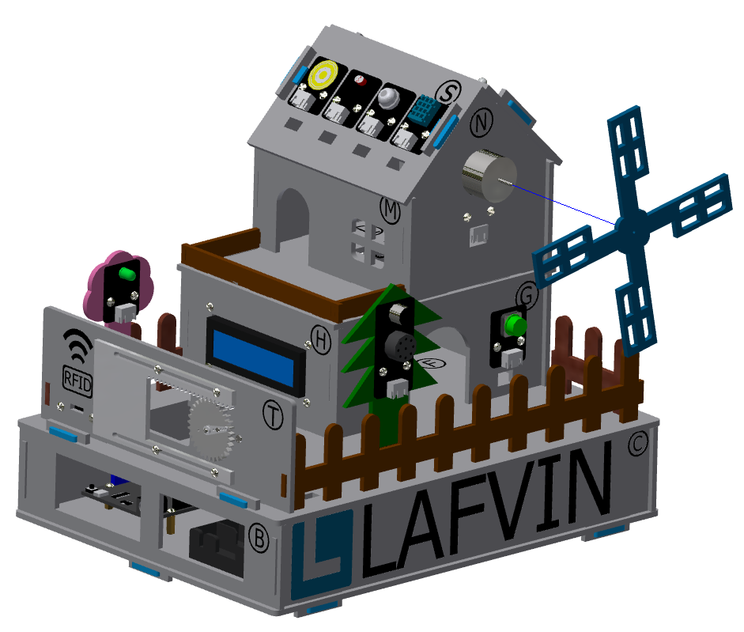

五、小屋固定部分的安装
===========================

步骤 1：底座固定
---------------------------
零件清单：蓝色的栓扣（8颗）

安装如下图所示：

.. raw:: html

   

.. admonition:: 注意事项

 - 请在传感器元件接线完成并调试运行正常后，再进行栓扣的安装和锁紧，以确保安装顺利且功能正常。

步骤 2：风车扇叶的安装
---------------------------
零件清单：蓝色风车扇叶

安装如下图所示：

.. raw:: html

   

步骤 3：调试窗口盖板的安装
---------------------------
零件清单：调试窗口盖板、带logo的栓扣

安装如下图所示：

.. image:: _static/调试盖板安装.png
   :alt: 调试窗口盖板
   :align: center

.. raw:: html

   

   
.. admonition:: 注意事项

 - 此盖板便于在日常对设备进行调试、检查接线及开发板状态时使用。

 
小屋安装完成效果图
---------------------------

.. image:: _static/小屋安装完成效果图.png
   :alt: 安装完成效果图
   :align: center