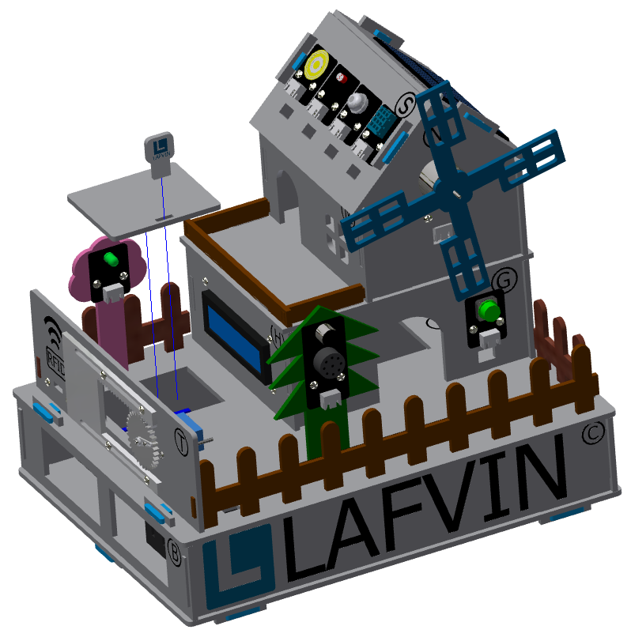

Installation of the fixed part of the cabin
===========================

Step 1: Attach the base
---------------------------
Parts List: Blue latch (8 PCS).

The installation is shown in the following figure:

.. image:: _static/23.栓扣安装.png
   :alt: 底座固定
   :align: center

.. raw:: html

   

.. admonition:: Precautions

 - Please install and tighten the latch after the sensor element is wired and debugged to ensure normal operation to ensure smooth installation and normal function.

Step 2: Installing the windmill blades
---------------------------
Parts List: Blue Windmill Blades.

The installation is shown in the following figure:

.. image:: _static/24.扇叶安装.png
   :alt: 风车扇叶
   :align: center

.. raw:: html

   

Step 3: Install the debug window cover
---------------------------
Parts list: debug window cover、 latch with logo.

The installation is shown in the following figure:

.. raw:: html

   

   
.. admonition:: Precautions

 - This cover is convenient for daily device debugging, wiring inspection, and development board status inspection.

 
The effect picture of the cabin installation
---------------------------

