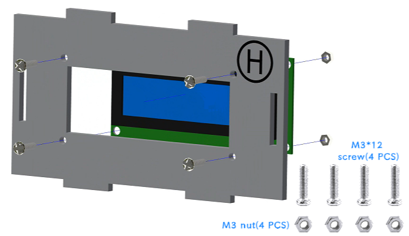
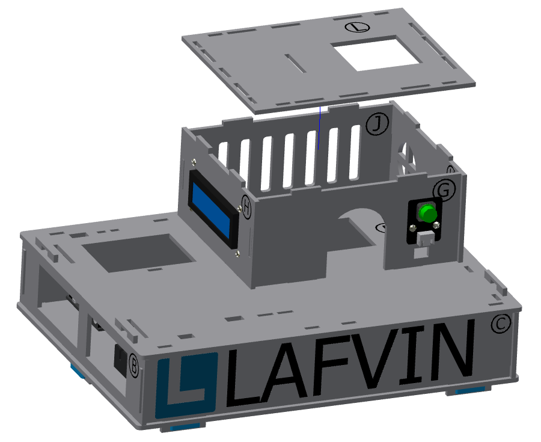
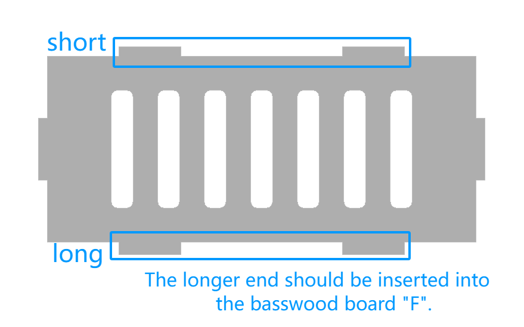

二、小屋一层的安装
===========================

步骤 1：按键模块的安装
---------------------------

零件清单：序号为“G”的椴木板、按键模块、M3*12mm螺丝（2颗）、M3螺母（2颗）。

安装如下图所示：

.. image:: _static/按键带螺丝.png
   :alt: 按键模块安装
   :align: center

步骤 2：LCD 屏幕的安装
---------------------------

零件清单：序号为“H”的椴木板、LCD屏幕、M3*12mm螺丝（4颗）、M3螺母（4颗）。

安装如下图所示：

.. image:: _static/屏幕安装方向示意图.png
   :alt: LCD安装方向
   :align: center
   :width: 600px

.. admonition:: 注意事项

 - 安装屏幕时，请确保带插座的一端黑色面板朝上，以防安装方向错误导致屏幕显示倒置。

步骤 3：小屋一层的组装
---------------------------

零件清单：序号为“J、K、L”的椴木板、安装好屏幕和按键的“G、H”椴木板

安装如下图所示：

.. image:: _static/7.一层护板安装.png
   :alt: 一层组装
   :align: center

 

.. admonition:: 注意事项

 - 序号为 “G、H、J、K” 的椴木板上下两端凸出长度不同。为确保安装牢固，凸出稍长的一端应插入序号为 “F” 的椴木板。

一层安装完成效果如图所示：

.. image:: _static/10.一层安装完成效果图.png
   :alt: 一层组装安装完成
   :align: center