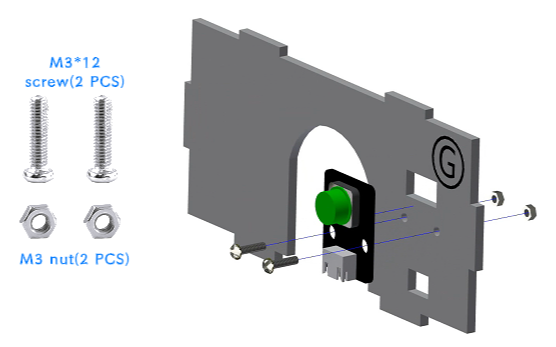
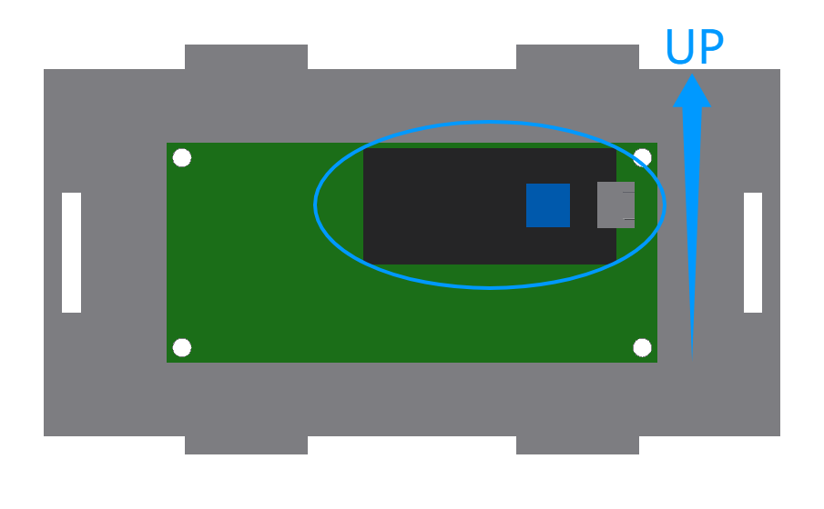
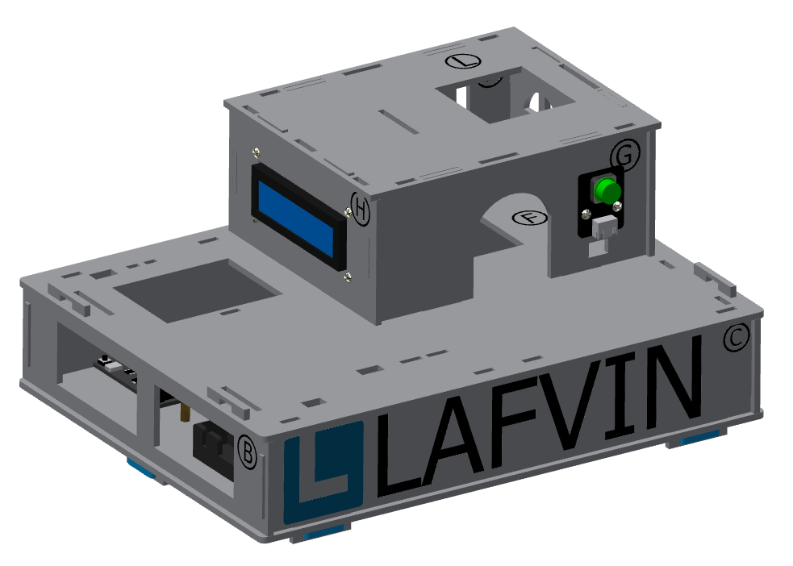

Installation of the first floor of the cabin
===========================

Step 1: Install the button module
---------------------------

Parts list: Basswood board with "G"、 button module、 M3*12mm screws (2 PCS)、 M3 nuts (2 PCS).

The installation is shown in the following figure:

Step 2: Installation LCD screen
---------------------------

Parts list: Basswood board with "H"、 LCD screen、 M3*12mm screws (4 PCS)、 M3 nuts (4 PCS).

The installation is shown in the following figure:

.. image:: _static/屏幕带螺丝.png
   :alt: LCD屏幕安装
   :align: center

.. admonition:: Precautions

 - When installing the screen, please make sure that the black panel with the socket is facing upwards to prevent the screen from being displayed upside down due to incorrect installation direction.

Step 3: Installation of the first floor of the cabin
---------------------------

Parts list: Basswood boards with "J, K, L", and "G, H" with screen and buttons installed.

The installation is shown in the following figure:

.. image:: _static/7.一层护板安装.png
   :alt: 一层组装
   :align: center

.. image:: _static/一层盖板安装1.png
   :alt: 一层组装
   :align: center
 

.. image:: _static/一层安装方向示意图.png
   :alt: 一层组装
   :align: center

.. admonition:: Precautions

 - Basswood boards with "G, H, J, K" have different protrusion lengths at the top and bottom. To ensure a secure fit, the longer protruding end should be inserted into the "F" board.

The effect of the first floor installation of the cabin is shown in the figure:

