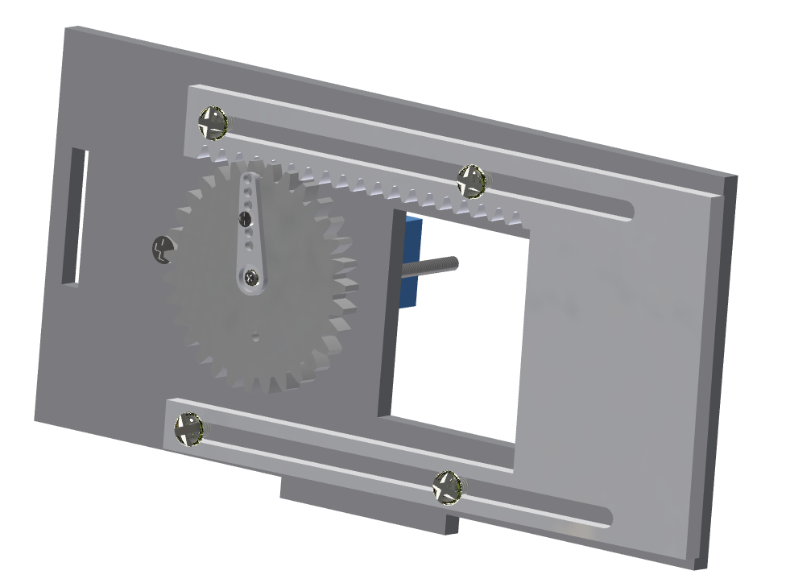
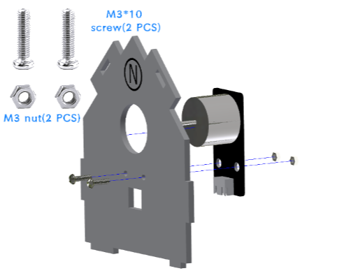
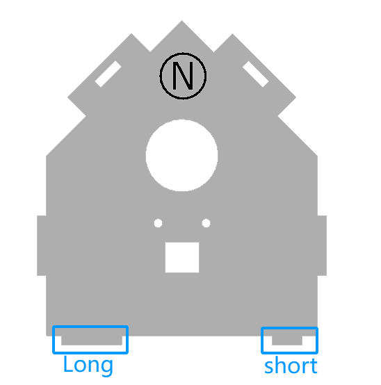

Installation of the second floor of the cabin
===========================

Step 1: Installation window 
---------------------------

Step 1-1: Installation of gear and swing arm
^^^^^^^^^^^^^^^^^^^^^^^
Parts list: acrylic gear、 servo bag (one-way swing arm)、 M1.5*5mm self-tapping screw (1 PCS).

The installation is shown in the following figure:

.. image:: _static/齿轮摆臂带螺丝.png
   :alt: 窗户齿轮
   :align: center

.. admonition:: Precautions

 - Align the small hole of the gear (either left or right) with the third small hole of the swing arm, then install it and tighten the screws.
 - The gear installation method in this step is the same as the subsequent gate control gear installation steps and parts used, so you can complete the installation in this step.

Step 1-2: Install the window servo on the basswood board
^^^^^^^^^^^^^^^^^^^^^^^^^^^^
Parts list: Basswood board with "P"、 servo bag (servo)、 M2*30mm screw (2 PCS)、 M2 nut (2 PCS).

The installation is shown in the following figure:

.. image:: _static/舵机带螺丝.png
   :alt: 舵机安装至椴木板
   :align: center

Step 1-3: Install the window gear and acrylic plate onto the basswood board
^^^^^^^^^^^^^^^^^^^^^^^^^^^^
Parts list: Basswood board with "P"、 window acrylic driver board (shorter acrylic)、 assembled gear、 servo package (shortest screw - M2*4mm)、 M3*12mm screw (4 PCS)、 M3 nut (4 PCS).

The installation is shown in the following figure:

.. image:: _static/窗户亚克力带螺丝.png
   :alt: 窗户亚克力安装
   :align: center

.. raw:: html

   

.. admonition:: Precautions

 - There is a film on both sides of the acrylic, please tear it off before installation.
 - When installing the acrylic window drive plate to the basswood board, the fixing screws do not need to be tightened too much, and appropriate margin should be left to ensure smooth sliding of the window.
 - The window's acrylic drive plate should be installed with the rack facing upwards.

Window installation completed effect picture:

Step 2: Installation of the Motor Fan
---------------------------
Parts list: Basswood board with  "N"、 motor fan module、 M3*12mm screw (2 PCS)、 M3 nut (2 PCS).

Window installation completed effect picture:

Step 3: Installing the Solar Charging Panel
---------------------------
Parts list: Basswood board with "R"、 solar charging panel、 solar charging indicator light、 glue.

The installation is shown in the following figure:

.. image:: _static/太阳能安装图.png
   :alt: 太阳能安装
   :align: center

.. image:: _static/太阳能安装接线示意图.png
   :alt: 太阳能接线
   :align: center

   
.. admonition:: Precautions

 - First, disconnect the wiring from both ends of the indicator light. Thread the solar panel wiring through the hole marked "R" in the basswood board and connect it to the indicator light wiring. Use some glue to secure it securely.

Step 4: Installation of the Sensor Module
----------------------
Parts list: Basswood board with "S"、 DHT11 temperature and humidity sensor、 human infrared sensor、 light-sensitive brightness sensor、 raindrop sensor、 M3*12mm screw (8 PCS)、 M3 nut (8 PCS).

The installation is shown in the following figure:

.. image:: _static/传感器安装带螺丝.png
   :alt: 传感器安装
   :align: center

.. admonition:: Precautions

 - Please fix the sensor in the recommended position according to the text marked on the basswood to ensure a stable and balanced installation.

Step 5: Installation of the second floor of the cabin
--------------------

Parts list: Basswood boards with  "M、 Q", and "N、 P" basswood boards with components installed.

The installation is shown in the following figure:

.. admonition:: Precautions

 - The lengths of the protrusions on the left and right sides of the lower ends of the basswood boards with "N, Q" are different. Please carefully distinguish the directions before installing to ensure a stable structure.
 
Step 6: Installation roof
----------------

Parts List: "S、 R" basswood board with components installed.

The installation is shown in the following figure:

.. image:: _static/15.屋顶安装.png
   :alt: 屋顶安装
   :align: center

.. raw:: html

   

Step 7: Installation of the Second Fence
---------------------------

Parts List: Brown basswood fence planks (shorter, 3 PCS).

The installation is shown in the following figure:

.. image:: _static/17.二层围栏安装.png
   :alt: 围栏安装
   :align: center

The effect picture of the second floor of the cabin after installation:

