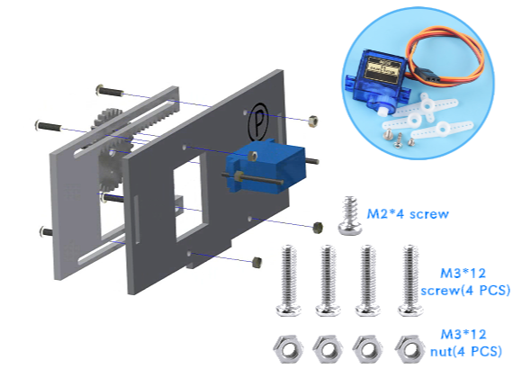

三、小屋二层的安装
===========================

步骤1：窗户部分的安装
---------------------------

步骤1-1：齿轮与摆臂的安装
^^^^^^^^^^^^^^^^^^^^^^^
零件清单：亚克力齿轮、舵机包（单向摆臂）、M1.5*5mm自攻螺丝（1颗）。

安装如下图所示：

.. image:: _static/齿轮摆臂带螺丝.png
   :alt: 窗户齿轮
   :align: center

.. admonition:: 注意事项

 - 将齿轮的小孔（左右任意一侧）与摆臂的第三个小孔对齐后安装，并拧紧螺丝。
 - 此处的齿轮安装方式与后续大门控制齿轮的安装步骤及所用零件相同，可在本步骤一并完成安装。

步骤1-2：窗户舵机安装至椴木板上
^^^^^^^^^^^^^^^^^^^^^^^^^^^^
零件清单：序号为“P”的椴木板、舵机包（舵机）、M2*30mm螺丝（2颗）、M2螺母（2颗）。

安装如下图所示：

.. image:: _static/舵机带螺丝.png
   :alt: 舵机安装至椴木板
   :align: center

步骤1-3：窗户的齿轮与亚克力板安装至椴木板上
^^^^^^^^^^^^^^^^^^^^^^^^^^^^
零件清单：序号为“P”的椴木板、窗户亚克力驱动板（较短的亚克力）、组装好的齿轮、舵机包（最短的一颗螺丝-M2*4mm）、M3*12mm螺丝（4颗）、M3螺母（4颗）

安装如下图所示：

.. raw:: html

   

.. admonition:: 注意事项

 - 将亚克力窗户驱动板安装到椴木板上时，固定螺丝无需拧得过紧，应保留适当余量，以保证窗户滑动顺畅。
 - 窗户的亚克力驱动板的齿条应朝上安装。

窗户安装完成效果图：

.. image:: _static/窗户安装完成效果图.png
   :alt: 窗户安装完成效果图
   :align: center

步骤2：电机风扇的安装
---------------------------
零件清单：序号为“N”的椴木板、电机风扇模块、M3*12mm螺丝（2颗）、M3螺母（2颗）。

安装如下图所示：

.. image:: _static/电机带螺丝.png
   :alt: 风扇安装
   :align: center
   :width: 600px

步骤3：太阳能充电板的安装
---------------------------
零件清单：序号为“R”的椴木板、太阳能充电板、太阳能充电指示灯、点胶。

安装如下图所示：

.. image:: _static/太阳能安装图.png
   :alt: 太阳能安装
   :align: center

.. image:: _static/太阳能安装接线示意图.png
   :alt: 太阳能接线
   :align: center

   
.. admonition:: 注意事项

 - 首先将指示灯两端的接线拆开。将太阳能板的接线穿过序号为 “R” 的椴木板上的开孔，再与指示灯接线连接。可使用点胶固定，以确保稳固。

步骤4：传感器模块的安装
----------------------
零件清单：序号为“S”的椴木板、DHT11温湿度传感器、人体红外传感器、光敏亮度传感器、雨滴传感器、M3*12mm螺丝（8颗）、M3螺母（8颗）。

安装如下图所示：

.. admonition:: 注意事项

 - 请根据椴木板上标注的文字，在推荐位置固定传感器，以确保安装稳固、平衡。

步骤5：小屋二层的安装
--------------------

零件清单：序号为“M、Q”的椴木板、安装好元件的“N、P”椴木板。

安装如下图所示：

.. image:: _static/14.二层护板安装2.png
   :alt: 二层组装
   :align: center

.. image:: _static/电机板材长短区分图.png
   :alt: 二层组装
   :align: center

.. admonition:: 注意事项

 - 序号为 “N、Q” 的椴木板下端左右两侧凸出的长度不同，请仔细区分方向后进行安装，以确保结构稳固。
 
步骤6：屋顶的安装
----------------

零件清单：安装好元件的“S、R”椴木板。

安装如下图所示：

.. image:: _static/15.屋顶安装.png
   :alt: 屋顶安装
   :align: center

.. raw:: html

   

步骤7：二层围栏的安装
---------------------------

零件清单：棕色的围栏椴木板（短小的、三条）

安装如下图所示：

.. image:: _static/17.二层围栏安装.png
   :alt: 围栏安装
   :align: center

小屋二层安装完成效果图：

.. image:: _static/16.二层安装完成效果图.png
   :alt: 二层安装完成效果图
   :align: center
