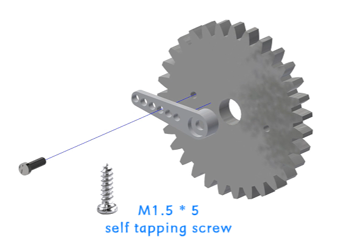
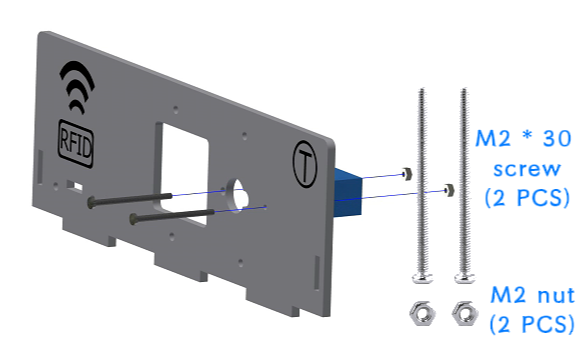
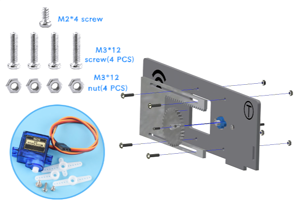
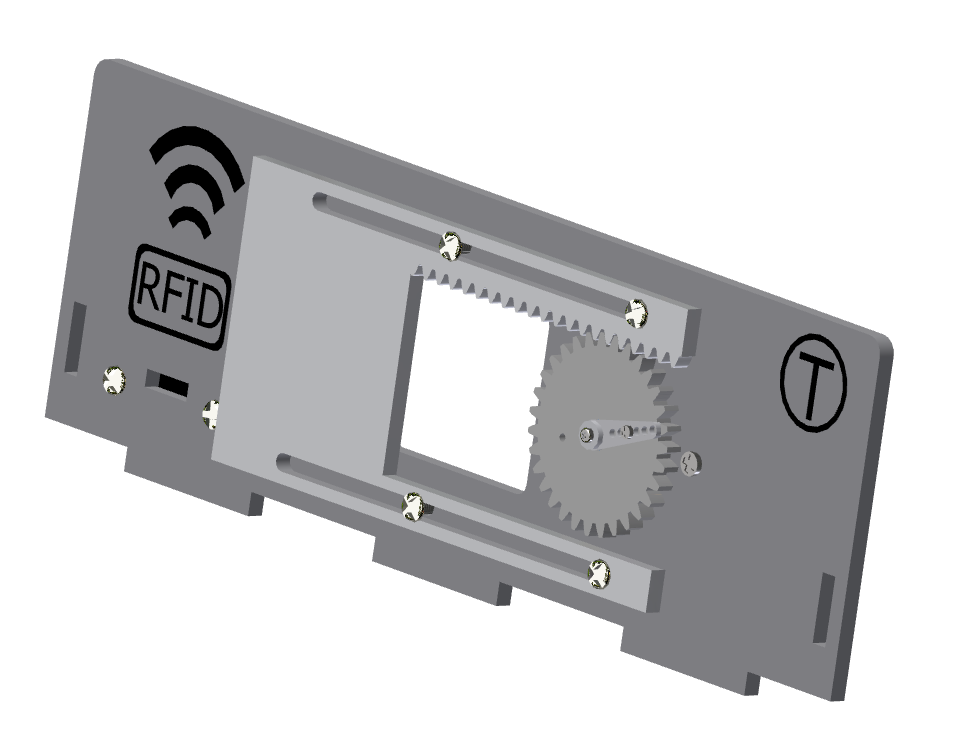
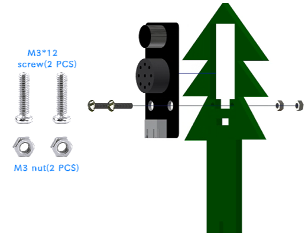
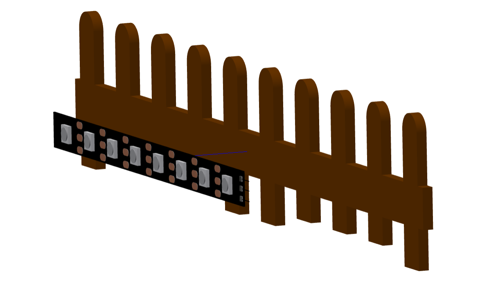

四、小屋花园的安装
===========================

步骤1：大门的安装
---------------------------

步骤1-1：齿轮与摆臂的安装
^^^^^^^^^^^^^^^^^^^^^^^
零件清单：亚克力齿轮、舵机包（单向摆臂）、M1.5*5mm自攻螺丝（1颗）。

安装如下图所示：

.. admonition:: 注意事项

 - 将齿轮的小孔（左右任意一侧）与摆臂的第三个小孔对齐后安装，并拧紧螺丝。
 - 此处的齿轮安装方式与之前窗户控制齿轮的步骤及零件相同。如已完成前述安装，本步骤可忽略。

步骤1-2：窗户舵机安装至椴木板上
^^^^^^^^^^^^^^^^^^^^^^^^^^^^
零件清单：序号为“T”的椴木板、舵机包（舵机）、M2*30mm螺丝（两颗）、M2螺母（2颗）。

安装如下图所示：

.. raw:: html

   

步骤1-3：大门的齿轮与亚克力板安装至椴木板上
^^^^^^^^^^^^^^^^^^^^^^^^^^^^
零件清单：序号为“P”的椴木板、亚克力驱动板（较长的亚克力）、组装好的齿轮、舵机包（最短的螺丝-M2*4mm）、M3*12mm螺丝（4颗）、M3螺母（4颗）

安装如下图所示：

.. raw:: html

   

.. admonition:: 注意事项

 - 将亚克力大门驱动板安装到椴木板上时，固定螺丝无需拧得过紧，应保留适当余量，以保证窗户滑动顺畅。
 - 大门的亚克力驱动板的齿条应朝上安装。

步骤1-4：RFID感应模块的安装
^^^^^^^^^^^^^^^^^^^^^^^^^^^^
零件清单：安装好亚克力大门驱动板以及舵机的椴木板T、RFID感应模块、M3*12mm螺丝（2颗）、M3螺母（2颗）

安装如下图所示：

.. image:: _static/RFID感应模块安装新.png
   :alt: RFID安装
   :align: center

.. raw:: html

   

大门安装完成效果图：

步骤1-5：大门安装到花园
^^^^^^^^^^^^^^^^^^^^^^^^^^^^
零件清单：安装好舵机、RFID感应模块以及亚克力的椴木板“T”。

安装如下图所示：

.. image:: _static/20.大门安装1.png
   :alt: 大门安装
   :align: center

.. raw:: html

   

步骤2：语音识别模块的安装
---------------------------
零件清单：语音识别模块、绿色的树椴木板、M3*12mm螺丝（2颗）、M3螺母（2颗）。

安装如下图所示：

步骤3：LED灯模块的安装
---------------------------
零件清单：LED灯模块、粉色的花椴木板、M3*12mm螺丝（2颗）、M3螺母（2颗）。

安装如下图所示：

.. image:: _static/LED灯带螺丝.png
   :alt: LED灯模块安装
   :align: center

步骤4：花和树安装到花园上
---------------------------
零件清单：安装好语音识别模块的绿色的树椴木板、安装好LED灯模块的粉色的花椴木板。

安装如下图所示：

.. image:: _static/21.花树安装.png
   :alt: 花树安装
   :align: center

.. raw:: html

   

   
步骤5：RGB灯带的安装
---------------------------
零件清单：RGB灯带、棕色的围栏椴木板（最长的一条围栏）

安装如下图所示：

.. admonition:: 注意事项

 - 先撕下灯带背面蓝色的胶带，再将灯带粘贴于围栏背面。
 - 为获得最佳发光效果，请尽量将 RGB 灯带居中粘贴在围栏背面

步骤6：花园围栏的安装
---------------------------
零件清单：棕色的花园围栏椴木板（短的2条）、安装好RGB灯带的围栏。

安装如下图所示：

.. image:: _static/22.花园围栏安装.png
   :alt: RGB安装
   :align: center

.. admonition:: 注意事项

 - 请区分短、长两条围栏。较长的一条应安装在大门旁，较短的一条应安装在按键模块旁。