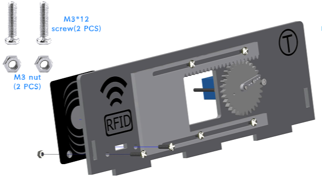
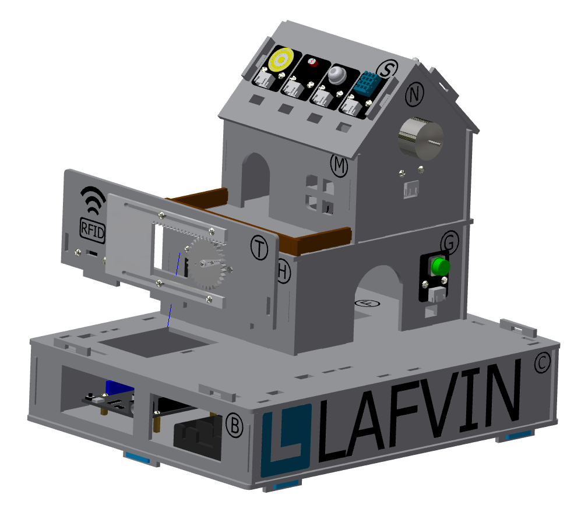
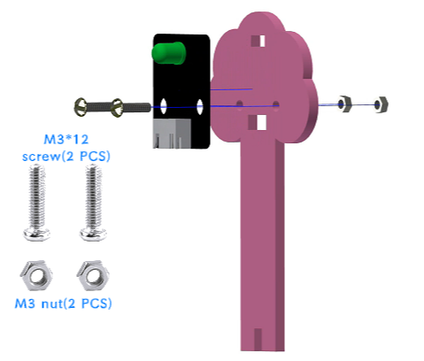

Installation of  garden
===========================

Step 1: Installation of the gate
---------------------------

Step 1-1: Installation of gear and swing arm
^^^^^^^^^^^^^^^^^^^^^^^
Parts list: acrylic gear、 servo bag (one-way swing arm)、 M1.5*5mm self-tapping screw (1 PCS).

The installation is shown in the following figure:

.. admonition:: Precautions

 - Align the small hole of the gear (either left or right) with the third small hole of the swing arm, then install it and tighten the screws.
 - The gear installation method here is the same as the window control gear installation steps and parts. If the previous installation has been completed, this step can be ignored.

Step 1-2: Install the gate servo on the basswood board
^^^^^^^^^^^^^^^^^^^^^^^^^^^^
Parts list: Basswood board with "T"、 servo bag (servo)、 M2*30mm screw (2 PCS)、 M2 nut (2 PCS).

The installation is shown in the following figure:

.. raw:: html

   

步骤1-3：大门的齿轮与亚克力板安装至椴木板上
^^^^^^^^^^^^^^^^^^^^^^^^^^^^
Parts list: Basswood board with "T"、 window acrylic driver board (shorter acrylic)、 assembled gear、 servo package (shortest screw - M2*4mm)、 M3*12mm screw (4 PCS)、 M3 nut (4 PCS)

The installation is shown in the following figure:

.. raw:: html

   

.. admonition:: Precautions

 - There is a film on both sides of the acrylic, please tear it off before installation.
 - When installing the acrylic gate drive plate to the basswood board, the fixing screws do not need to be tightened too much, and appropriate margin should be left to ensure smooth sliding of the window.
 - The gate's acrylic drive plate should be installed with the rack facing upwards.

Step 1-4: Installation of RFID sensor module
^^^^^^^^^^^^^^^^^^^^^^^^^^^^
Parts list: Acrylic door drive board and basswood board "T" with servo installed、 RFID sensor module、 M3*12mm screw (2 PCS)、 M3 nut (2 PCS)

The installation is shown in the following figure:

.. raw:: html

   

The effect picture of the gate installation is completed:

Steps 1-5: Installing the gate to the garden
^^^^^^^^^^^^^^^^^^^^^^^^^^^^
Parts List: Installed servos、 RFID sensor module、 and acrylic basswood board "T".

The installation is shown in the following figure:

.. raw:: html

   

Step 2: Install the speech recognition module
---------------------------
Parts list: speech recognition module、 green basswood board、 M3*12mm screw (2 PCS)、 M3 nut (2 PCS).

The installation is shown in the following figure:

Step 3: Installation of LED Light Module
---------------------------
Parts list: LED light module、 pink basswood board、 M3*12mm screw (2 PCS)、 M3 nuts (2 PCS).

The installation is shown in the following figure:

Step 4: Installing flowers and trees in the garden
---------------------------
Parts list: Green linden wood board with voice recognition module installed、 pink linden wood board with LED light module installed.

The installation is shown in the following figure:

.. image:: _static/21.花树安装.png
   :alt: 花树安装
   :align: center

.. raw:: html

   

   
Step 5: Installing the RGB Light Strip
---------------------------
Parts list: RGB light strip、 brown basswood fence board (The longest fence)

The installation is shown in the following figure:

.. image:: _static/RGB灯带安装.png
   :alt: RGB安装
   :align: center

.. admonition:: Precautions

 - First tear off the blue tape on the back of the light strip, and then stick the light strip on the back of the fence.
 - To achieve the best lighting effect, please stick the RGB light strip in the center of the back of the fence.

Step 6: Installation of the Garden Fence
---------------------------
Parts list: Brown garden fence basswood planks (2 shorter ones)、 fence with RGB light strip installed.

The installation is shown in the following figure:

.. image:: _static/22.花园围栏安装.png
   :alt: RGB安装
   :align: center

.. admonition:: Precautions

 - Please distinguish between the short and long fences. The longer one should be installed next to the gate, and the shorter one should be installed next to the key module.