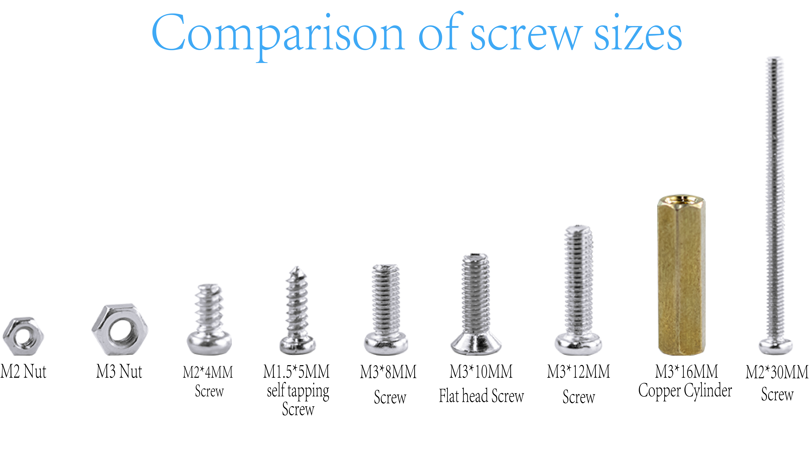

智能家居小屋安装教程
===========================
（此处图片可换为实拍图）

.. figure:: _static/小屋安装完成效果图.png
   :alt: 安装完成效果图
   :align: center

   （智能家居小屋安装完成效果图）

引言
----
  本教程适用于 LA-Smart-Home 智能家居小屋安装。为确保安装高效且无误，请在安装前认真阅读全部步骤与注意事项。

安装视频教程
-----------
（此处会插入一段安装的视频教程）

螺丝尺寸比较
------------
  本产品在安装过程中会用到多种不同型号的螺丝。请务必在安装前逐一核对螺丝型号并参照本教程中对应步骤使用指定型号，
  严禁混用或以其他型号代替，以免因螺丝规格不符导致无法安装或损坏产品。如遇无法辨认，请停止操作并参阅配件清单或联系售后确认。

*现在，请按照本教程的步骤操作，让我们一起开始安装 LA-Smart-Home 智能家居小屋吧。*
